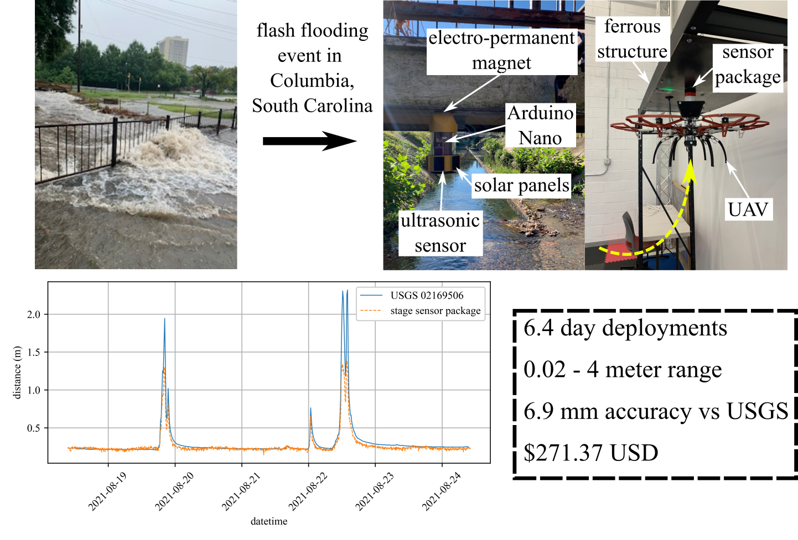

# UAV-Deployable-Stage-Height-Sensor
UAV Deployable Stage Height Sensor with Electro-permanent Magnet Docking Mechanism

Figure 1: Drone delivering a sensor package underneath a structure.

## V0
1. Data logging saved onto SD card
2. Battery monitoring
3. Solar load sharing
4. Measures stage, temperature, pressure, humidity
5. EPM with wireless toggling to attach under structures

## V1 (projected)
1. Adaptive sampling algorithm
2. Wireless data transfer with GUI
3. Camera integration

## Licensing and Citation

[![CC BY-SA 4.0][cc-by-sa-shield]][cc-by-sa]

This work is licensed under a
[Creative Commons Attribution-ShareAlike 4.0 International License][cc-by-sa].

[cc-by-sa]: http://creativecommons.org/licenses/by-sa/4.0/
[cc-by-sa-image]: https://licensebuttons.net/l/by-sa/4.0/88x31.png
[cc-by-sa-shield]: https://img.shields.io/badge/License-CC%20BY--SA%204.0-lightgrey.svg

Cite as:

@Misc{Smith2022UAVDeployableStage,     
  author = {Corinne Smith and Austin Downey},  
  howpublished = {GitHub},  
  title  = {{UAV} Deployable Stage Height Sensor},
  year   = {2022},  
  groups = {{ARTS-L}ab},    
  url    = {https://github.com/ARTS-Laboratory/UAV-Deployable-Stage-Height-Sensor},   
}
