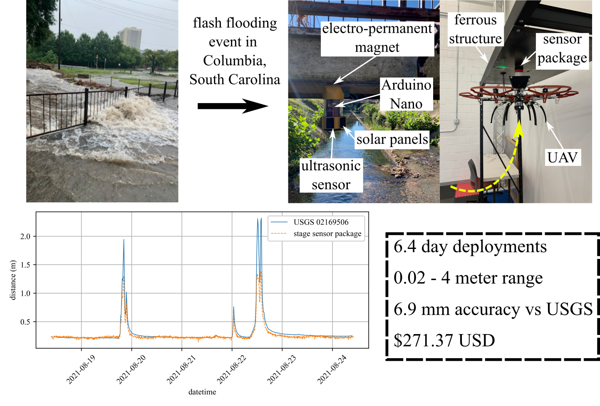

# UAV Rapidly-Deployable Stage Sensor with Electro-permanent Magnet Docking Mechanism for Flood Monitoring in Undersampled Watersheds

## bill of materials
A complete bill of materials, with specifications for the base package, solar add-on module, and EPM add-on module

## CAD
STL and F3D files of 3D printed parts 

## code
Calibration and data collection codes

## EDA
KiCAD schematics and PCB layouts of main and daughter boards

## figures
SVG and PDF files of all figures presented in the work

## testing_data
Data from benchtop and field tests

## data_headers.csv
Example data headers for csv file generated by data_collection.ino

